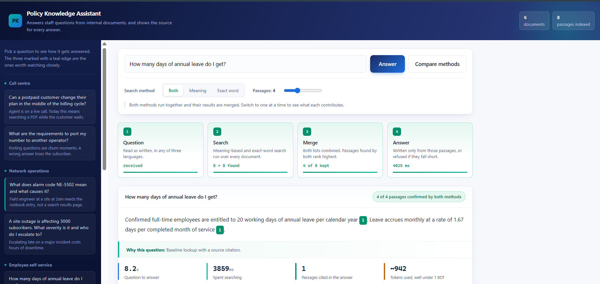
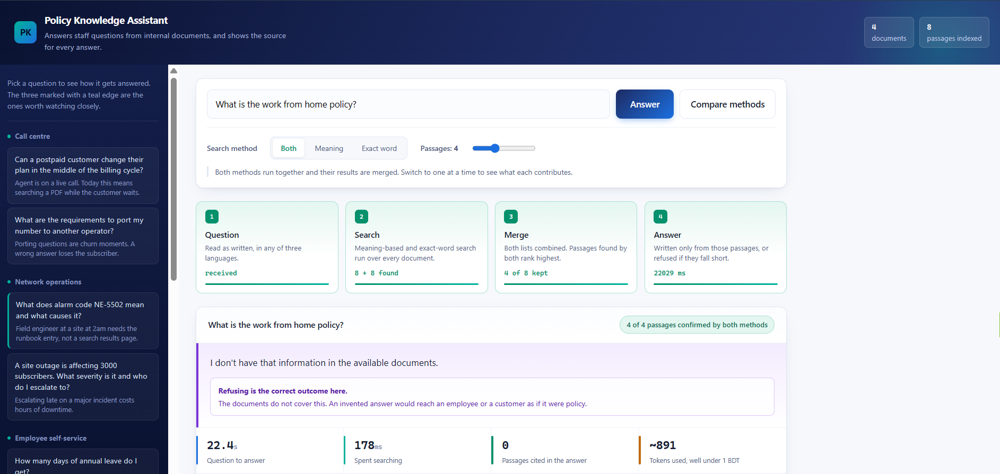
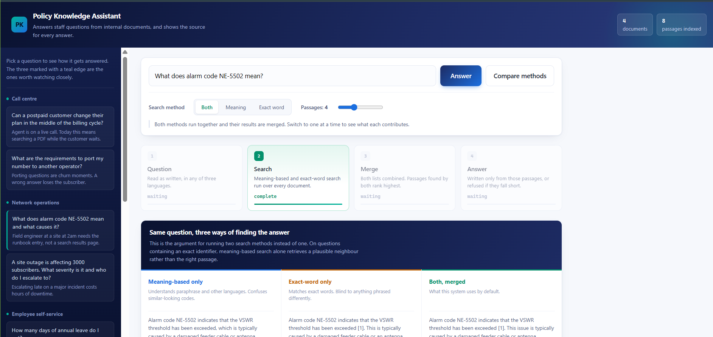

# Enterprise GenAI Portfolio





Three working projects covering the patterns that most enterprise AI work actually falls into: grounded retrieval over internal documents, tool-using agents, and structured extraction from messy text.

Built around a telecom operator's problems — internal policy lookup, customer support, and complaint triage — with multilingual handling for English, Bangla and romanised Bangla throughout.

**Stack:** Python · LangChain · LangGraph · ChromaDB · FastAPI · Pydantic · Google Gemini

> Built as a self-directed learning project to move from zero hands-on LLM experience to working systems. These are demos designed to be explained, not production deployments — each project's README documents what is missing and why.

---

## 1. Policy Knowledge Assistant

RAG over internal HR, finance, network-operations and customer-care documents. Answers cite their sources, and refuse when the documents don't cover the question.

**What makes it more than a tutorial RAG:**

- **Hybrid retrieval.** Semantic search and BM25 keyword search run in parallel, then their ranked lists are fused with Reciprocal Rank Fusion (implemented by hand, not imported). Semantic search alone fails on alphanumeric identifiers — `NE-5502` and `NE-3310` embed almost identically — which matters when every telecom document is full of plan codes and alarm codes.
- **Refusal as a measured feature.** Three of the 21 evaluation cases are deliberately unanswerable. A system that invents a policy is worse than no system in a call centre.
- **Multilingual by design.** Uses a multilingual embedding model. The common tutorial default (`all-MiniLM-L6-v2`) is English-only and doesn't error on Bangla — it returns confidently wrong results, which is the more dangerous failure.
- **Evaluation harness.** Retrieval metrics (hit rate, MRR) are measured separately from generation metrics, because when an answer is wrong you need to know which half broke.
- **FastAPI backend + web UI** that exposes retrieval provenance: every passage is colour-coded by which retriever found it, at what rank, and whether the model actually cited it.

```
data/*.md ──> ingest.py ──────────────────────────────> chroma_db/
              load → chunk → embed → persist

question ──> rag.py
             ├── semantic search  ─┐
             │                     ├── RRF fusion ──> top k ──> grounded prompt ──> answer + [1][2]
             └── BM25 keyword     ─┘

golden_set.json ──> eval.py ──> hit rate · MRR · keyword recall · refusal accuracy
```

## 2. Customer Support Agent

A tool-using agent built as an **explicit LangGraph state machine** rather than a prebuilt wrapper, so the reasoning loop can be inspected and explained.

Four tools: subscriber lookup, policy search, plan catalogue, and ticket creation (the only one with side effects, deliberately separated).

The showcase case: *"Can I upgrade my plan today?"* requires looking up the account, discovering it's postpaid, then searching for the rule that applies **to postpaid specifically**, then noticing outstanding dues trigger a second independent blocker. The second lookup depends on the first result — which is exactly when an agent earns its cost over a fixed chain.

```
START ──> [ reason ] ──should_continue──> "tools" ──> [ execute ] ──┐
             ^                                                      │
             └──────────────────────────────────────────────────────┘
                            │
                          "end" ──> END
```

## 3. Complaint Triage Engine

Turns 30 free-text customer complaints — mixed Bangla, English and Banglish — into validated Pydantic records, then into a management brief.

The point is **structured output, not chat**. Prose can't be consumed by a routing queue or a dashboard; a validated schema can. `Literal` types make invalid categories impossible rather than merely discouraged.

One extraction pass produces two kinds of value: operational (automatic routing) and analytical (complaint volume by area and severity becomes a network-investment signal). Pandas computes every number in the report; the model only writes prose over figures it was handed.

---

## Quick start

Requires Python 3.11 or 3.12. Python 3.13 breaks some dependencies.

```bash
git clone https://github.com/YOUR-USERNAME/YOUR-REPO.git
cd YOUR-REPO

python -m venv venv
venv\Scripts\activate           # Windows
source venv/bin/activate        # macOS / Linux

python -m pip install -r 01-policy-rag-assistant/requirements.txt \
                       -r 02-support-agent-langgraph/requirements.txt \
                       -r 03-complaint-triage-engine/requirements.txt
```

Get a free Gemini API key at [aistudio.google.com/apikey](https://aistudio.google.com/apikey), then copy `.env.example` to `.env` in each project folder and add it.

```bash
cd 01-policy-rag-assistant
python llm_setup.py             # verify model + embeddings
python ingest.py --rebuild      # build the index (once)
python -m uvicorn api:app       # then open http://127.0.0.1:8000
```

Other entry points:

```bash
python eval.py --compare                          # hybrid vs semantic vs keyword
python rag.py "What does alarm code NE-5502 mean?" --show-chunks
cd ../02-support-agent-langgraph && python agent.py --scenario 2 --trace
cd ../03-complaint-triage-engine && python triage.py --all && python report.py
```

### Running without internet

Every model call routes through `llm_setup.py`, so switching providers is a config change. Install [Ollama](https://ollama.com), run `ollama pull llama3.1:8b`, and set `LLM_PROVIDER=ollama`. Embeddings already run locally.

---

## Design decisions

**A provider abstraction, not direct API calls.** Every model call goes through one factory. This paid off immediately: Google retired `gemini-2.0-flash` mid-build, and fixing all three projects was a one-line config change. A second helper normalises response content, because newer Gemini models return typed blocks where older ones returned a plain string. Vendors change formats; the abstraction is where that gets absorbed.

**Local embeddings.** Embeddings run over every chunk of every document, so an API-based embedder is the line item that makes a RAG pilot expensive. Running them locally is free and keeps document text off third-party servers — which matters when the documents are internal policy.

**RRF written by hand.** BM25 scores and cosine similarities aren't on comparable scales, so naively adding them lets whichever has the larger numeric range win. RRF uses only rank position, so a passage ranked decently by both retrievers beats one ranked first by only one. Worth understanding rather than importing.

**Agents used sparingly.** Project 2 is an agent because the path genuinely depends on what's found. Project 1 is a fixed chain because it doesn't. Agents add a model call per step, non-determinism, and tool-selection failure modes that chains don't have.

**Refusal treated as a first-class outcome.** Not an error state in the UI, not an exception in the code — a measured metric with its own test cases.

---

## Known limitations

Documented rather than hidden:

- No reranking layer — a cross-encoder over the top 20 would be the next largest accuracy gain
- Table handling is naive; a table split across chunks produces confident nonsense
- Answer scoring in `eval.py` checks for expected keywords, which is a proxy for correctness rather than a measure of it
- The BM25 index is in memory; real scale needs OpenSearch or equivalent
- No conversation memory, so follow-up questions like "and for postpaid?" fail
- No authentication or access control — in production, permissions would be enforced at the retrieval layer, not the UI
- Project 3 has no labelled ground truth; the classifications look right but "looks right" isn't a metric

---

## Repository layout

```
├── 01-policy-rag-assistant/     RAG + hybrid retrieval + FastAPI + eval
├── 02-support-agent-langgraph/  LangGraph agent with four tools
├── 03-complaint-triage-engine/  Structured extraction + reporting
└── preflight.py                 Checks everything is set up correctly
```

Each project folder has its own README with a run guide and the engineering reasoning behind it.